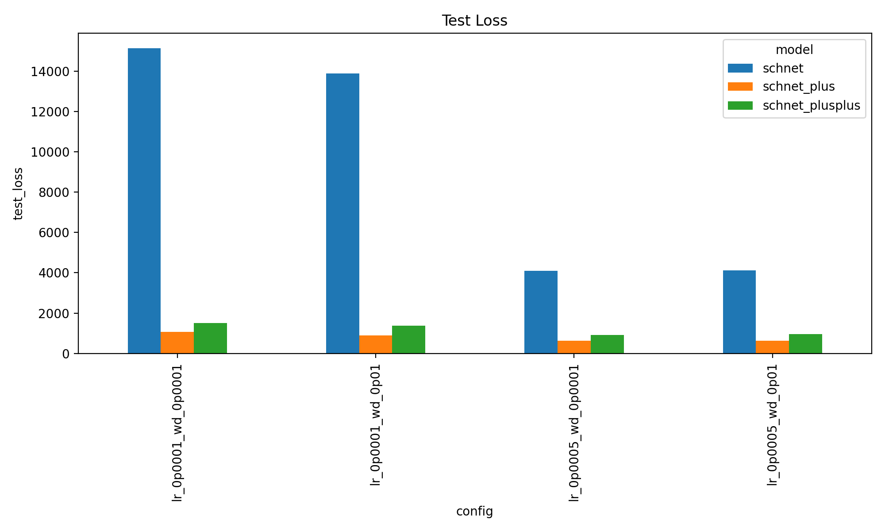
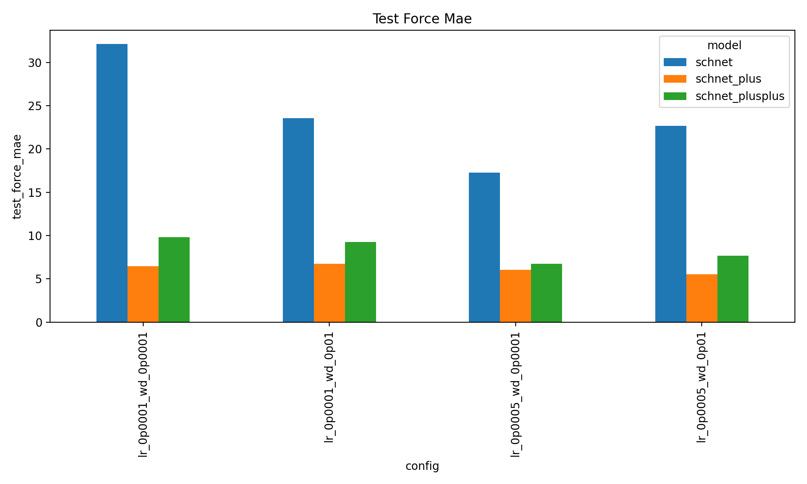
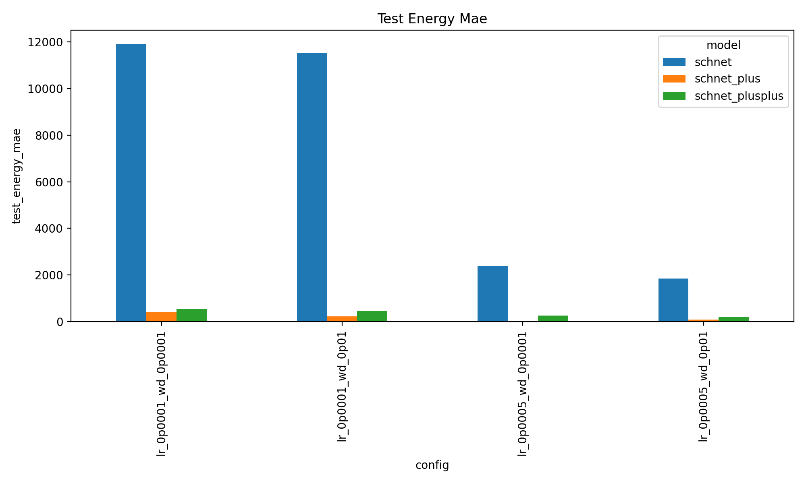
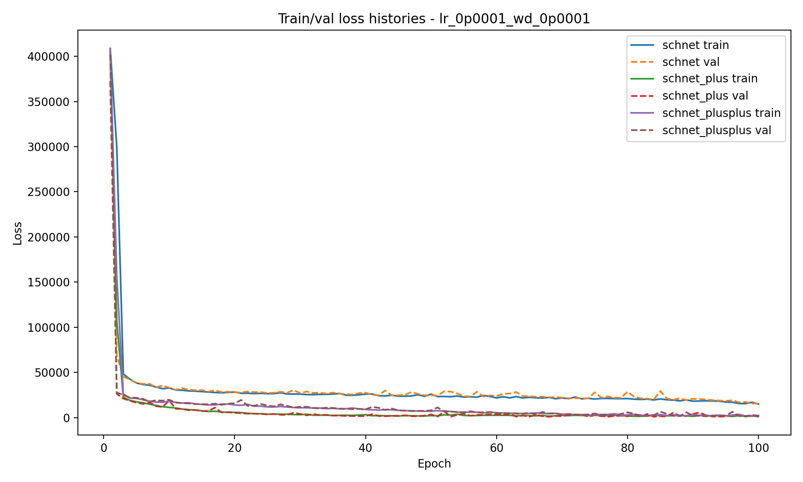
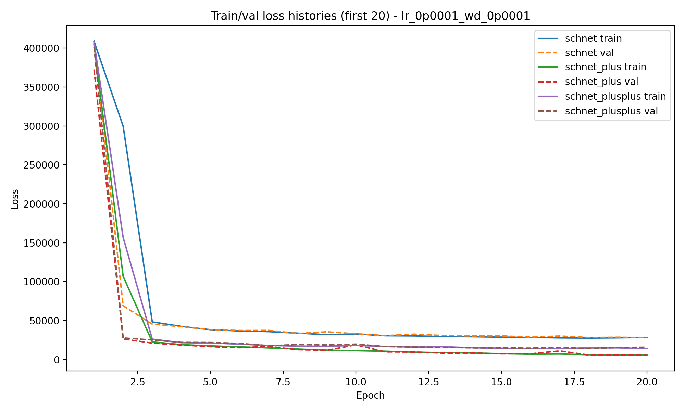

# Machine Learning Force Fields with Better Aggregation

This repository studies whether **changing only neighborhood aggregation** can substantially improve graph neural network force fields for molecular systems. Starting from SchNet, two variants—**SchNet+** and **SchNet++**—replace the standard single sum aggregation with richer permutation-invariant aggregation schemes, leading to markedly lower energy and force errors on rMD17 aspirin while increasing parameter count by only a constant factor.

## Problem

Molecular dynamics needs accurate energies and atomic forces, but first-principles methods such as DFT are often too expensive for large-scale simulation. Machine-learned force fields aim to approximate the potential energy surface efficiently by learning from quantum-mechanical reference data. This project asks a focused question:

> How much can SchNet improve if the message function stays essentially the same, but the **aggregation step** becomes more expressive?

## Models

### Baseline: SchNet

Given atomic embeddings $\(h_{i}\)$ and pairwise distances $\(r_{ij} = \lVert {r}_i - {r}_j \rVert\)$, a SchNet interaction block computes

$$
m_{ij} = \phi_{\text{msg}}(\mathbf{h}_j) \odot W(r_{ij})
$$
$$
\mathbf{m}_i = \sum_{j \in \mathcal{N}(i)} m_{ij}
$$
$$
\mathbf{h}_i^{\text{new}} = \mathbf{h}_i + \phi_{\text{upd}}(\mathbf{m}_i)
$$

So the key aggregation operation is simply a **sum over neighbor messages**.

### SchNet+

SchNet+ keeps the same message function but aggregates each local neighborhood in four different ways:

$$
\mathbf{m}_i^{\text{sum}} = \sum_j m_{ij}
$$
$$
\mathbf{m}_i^{\text{avg}} = \frac{1}{|\mathcal{N}(i)|}\sum_j m_{ij}
$$
$$
\mathbf{m}_i^{\max} = \max_j m_{ij}
$$
$$
\mathbf{m}_i^{\min} = \min_j m_{ij}
$$

Each aggregate is passed through the same update MLP, and the resulting node states are concatenated and fused:

$$
\mathbf{h}_i^{\text{new}} = W_f\[\mathbf{h}_i^{\text{sum}}, \mathbf{h}_i^{\text{avg}}, \mathbf{h}_i^{\max}, \mathbf{h}_i^{\min}\]
$$

This gives the model several complementary “views” of the neighborhood: total contribution, average behavior, strongest feature response, and weakest feature response.

### SchNet++

SchNet++ replaces the hand-designed set of min/mean/max-style summaries with a learnable generalized mean based on log-sum-exp:

$$
(\mathbf{m}_i^{\text{lse}})_d =
\frac{1}{\alpha_d}
\log\left(
\frac{1}{|\mathcal{N}(i)|}
\sum_j \exp(\alpha_d (m_{ij})_d)
\right).
$$

As $\(\alpha_d \to 0\)$, this approaches the arithmetic mean; large positive and negative values smoothly move it toward max and min behavior. SchNet++ then fuses only two summaries,

$$
\mathbf{h}_i^{\text{new}} = W_f\[\mathbf{h}_i^{\text{sum}}, \mathbf{h}_i^{\text{lse}}\]
$$

which makes it more parameter-efficient than SchNet+ while retaining a learnable multi-view aggregation mechanism.

## Dataset and Training Setup

The experiments use the **rMD17** benchmark on the **aspirin** molecule.

| Item | Value |
|---|---:|
| Dataset | rMD17 |
| Molecule | Aspirin |
| Train split | 1000 structures |
| Validation split | 200 structures |
| Test split | 1000 structures |
| Interaction blocks | 4 |
| Hidden dimension | 128 |
| Radial basis functions | 50 |
| Optimizer | AdamW |
| Epochs | 100 |
| Learning rates | $\(10^{-4}, 5\times10^{-4}\)$ |
| Weight decays | $\(10^{-4}, 10^{-2}\)$ |

The models are trained jointly on energies and forces, with forces obtained from the energy gradient:

$$
\mathbf{F}_i = -\nabla_{\mathbf{r}_i} E(\mathbf{R})
$$

The training objective is

$$
\mathcal{L} = w_E\mathrm{MAE}(E, \hat{E}) + w_F\mathrm{MAE}(\mathbf{F}, \hat{\mathbf{F}})
$$

with $\(w_E = 1\)$ and $\(w_F = 100\)$, emphasizing accurate force prediction.

## Main Results

Across all four optimizer settings, SchNet+ and SchNet++ consistently outperform the original SchNet.

### Error trends

- Force MAE drops from roughly **20–30** for SchNet to roughly **6–10** for SchNet+ and SchNet++.
- Energy MAE improves by about **one order of magnitude**.
- Total test loss decreases by roughly **90%** relative to SchNet.
- The modified models also converge **faster in epochs**.

### Parameter-growth tradeoff

- **SchNet+**: about **2×** the parameters of SchNet.
- **SchNet++**: about **1.5×** the parameters of SchNet.
- Despite being smaller than SchNet+, **SchNet++ achieves comparable loss reductions**, making it the more parameter-efficient extension.

## Reported Efficiency Score

The report defines an efficiency score that measures how much test loss is reduced relative to how much parameter count increases, using SchNet as the baseline:

$$
\mathrm{efscore}(m) =
\frac{\frac{TL(\mathrm{SchNet}) - TL(m)}{TL(\mathrm{SchNet})}}
{\frac{P(m) - P(\mathrm{SchNet})}{P(\mathrm{SchNet})}}
$$

A score larger than 1 means the relative loss improvement is larger than the relative parameter increase.

| Model | Relative total error improvement | Relative parameter increase | Efficiency score |
|---|---:|---:|---:|
| SchNet+ | 0.89 | 0.82 | 1.09 |
| SchNet++ | 0.84 | 0.41 | 2.05 |

This supports the main qualitative conclusion: **SchNet++ gives almost the same performance gain as SchNet+ with much less parameter overhead**.

## Parameter Count Analysis

Let $\(n\)$ be the hidden dimension, $\(m\)$ the number of interaction blocks, and $\(n_{rbf}\)$ the number of radial basis functions.

### SchNet

$$
\mathrm{SchNet}(n,m) = (4m+1)n^2 + (5m + mn_{rbf} + 120)n + 1
$$

### SchNet+

$$
\mathrm{SchNet+}(n,m) = (8m+1)n^2 + (6m + mn_{rbf} + 120)n + 1
$$

### SchNet++

$$
\mathrm{SchNet++}(n,m) = (6m+1)n^2 + (7m + mn_{rbf} + 120)n + 1
$$

For large models,

$$
\lim_{m,n\to\infty}
\frac{\mathrm{SchNet+}(n,m)}{\mathrm{SchNet}(n,m)} = 2
$$
$$
\lim_{m,n\to\infty}
\frac{\mathrm{SchNet++}(n,m)}{\mathrm{SchNet}(n,m)} = 1.5
$$

So both extensions increase model size only by a **constant factor**, not by a qualitatively different growth rate.

## Figures

### Cross-configuration total test loss

### Cross-configuration force MAE

### Cross-configuration energy MAE

### Example learning curves

## Takeaways

- Aggregation is a **high-leverage design choice** in molecular GNNs.
- Better neighborhood summaries can improve both **accuracy** and **optimization speed**.
- SchNet+ gives the strongest multi-aggregation variant.
- SchNet++ preserves most of that benefit with a much better **performance-to-parameter ratio**.
- For data-limited settings such as rMD17, careful inductive bias can matter more than simply scaling width or depth.

## Report

I strongly suggest you to read the [report](/report/dl-report.pdf) for detailed theoritical explanations of the model, mathematical analysis, and training results. Moreover, there is a [presentation](/report/presentation.pdf) in which the architectures of SchNet/Schnet+/Schnet++ are visualized.
